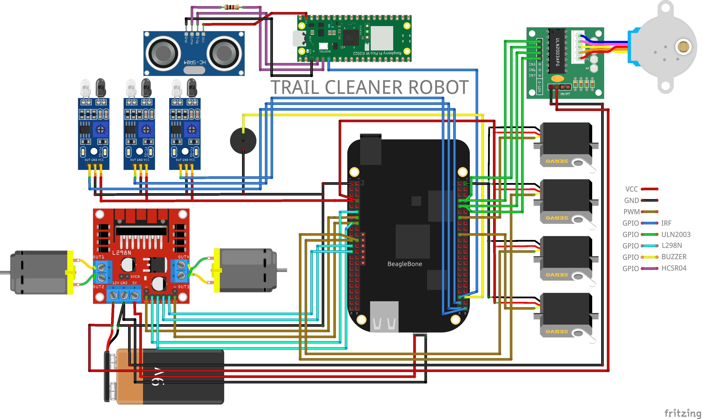
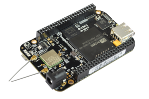
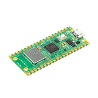
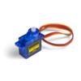
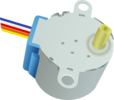
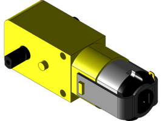
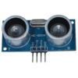
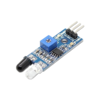
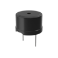

# Robô Limpador de Trilhos - BeagleBone Black



Este projeto implementa um robô que consiste em um braço robótico acoplado à um carro que segue uma trilha, ambos controlados pela placa BeagleBone Black. Quando avistado um obstáculo, é estabelecida uma distância e então realizados movimentos pré-definidos para tentar remover esse obstáculo, caso não seja possível, é emitido um alerta em um servidor WEB local que está rodando em uma Raspberry Pi Pico solicitando controle manual remoto por este servidor. Caso a remoção seja possível, é emitido um LOG no servidor com a data e o local.

## Funcionamento

O braço robótico possui 4 articulações e uma base, articulações estas que replicam o movimento de uma garra, pulso, cotovelo, e ombro. Todas as articulações são controladas por servos motores SG90, enquanto a base é controlada por um motor de passos.

O carro possui duas rodas maiores na frente, e uma menor para equilíbrio atrás. As rodas da frente são controladas por um motor DC para cada uma. O carro acompanha um trajeto de linha preta, onde utilizam-se três sensores infravermelhos reflexivos. Dois deles identificam se o carro está fora dos trilhos, e um fica no meio identificando se ele está nos trilhos para polimento do movimento.

O carro detecta obstáculos a sua frente por meio de um sensor ultrassônico HC-SR04

## Componentes
| Componente | Quantidade | Descrição | Imagem |
| ---------- |------------| --------- | ------ |
| BeagleBone Black | 1          | Plataforma de Desenvolvimento |  | 
| Raspberry Pi Pico W | 1          | Plataforma de Desenvolvimento |  |
| SG90 | 4          | Servo Motor |  |
| 28BYJ-48 | 1          | Motor de Passos |  |
| Motor DC | 2          | Motor 3V-6V |  |
| HC-SR04 | 1          | Sensor Ultrassônico |  |
| IR Sensor | 3          | Sensor Infravermelho Reflexivo |  |
| L298N | 1          | Ponte H | |
| Buzzer | 1 | Gerador de sinais sonoros |  |


## Estrutura do Projeto

O projeto está organizado da seguinte forma:

```
tcrobot/
├── inc/             # Arquivos de cabeçalho (.h)
├── obj/             # Objetos compilados (.o)
└── src/             # Arquivos de código fonte (.c)
│ Makefile           # Arquivo de compilação
resources/           # Recursos (mídia) do projeto
│   └── base.png     # Arquitetura base do projeto (pinos)
README.md            # Documentação do projeto (você está aqui)
```

## Execução

O projeto executa em um sistema `Linux`, em um ambiente desenvolvido via `buildroot`.

Cada componente possui seu próprio processo executando em paralelo, com todos os gerenciamentos de recursos e prioridades aplicados.

## Autores

- [Ryan Guilherme](https://github.com/ryanguilherme)
- [Guilherme Araújo](https://github.com/guiaf04)
- [Éliton Melo](https://github.com/elitonnmelo)

## Disciplina e Instituição

Este projeto foi desenvolvido como o projeto final da disciplina TPSE II (Técnicas de Programação para Sistemas Embarcados II), ministrada pelo professor Francisco Helder, na Universidade Federal do Ceará (UFC), Campus Quixadá.

## Contribuições

Contribuições são bem-vindas! Se você encontrar problemas, bugs ou tiver sugestões de melhorias, fique à vontade para abrir uma issue ou enviar um pull request neste repositório.

## Licença

Este projeto está licenciado sob a [MIT License](LICENSE).
